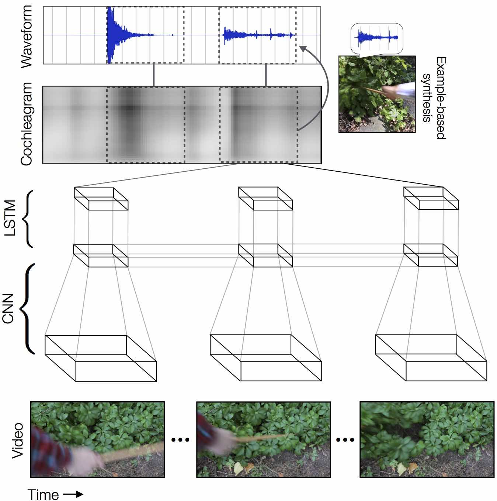
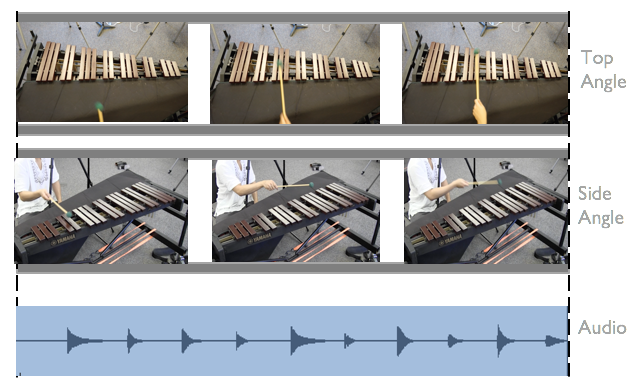
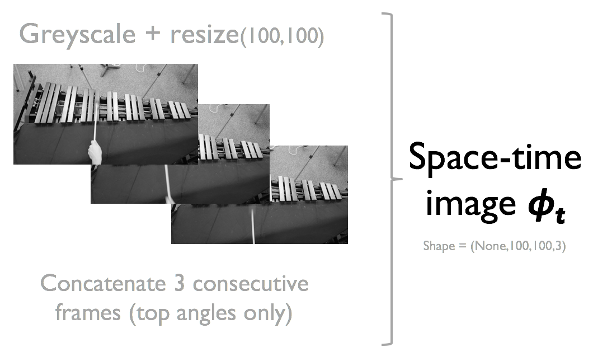
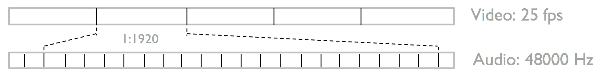
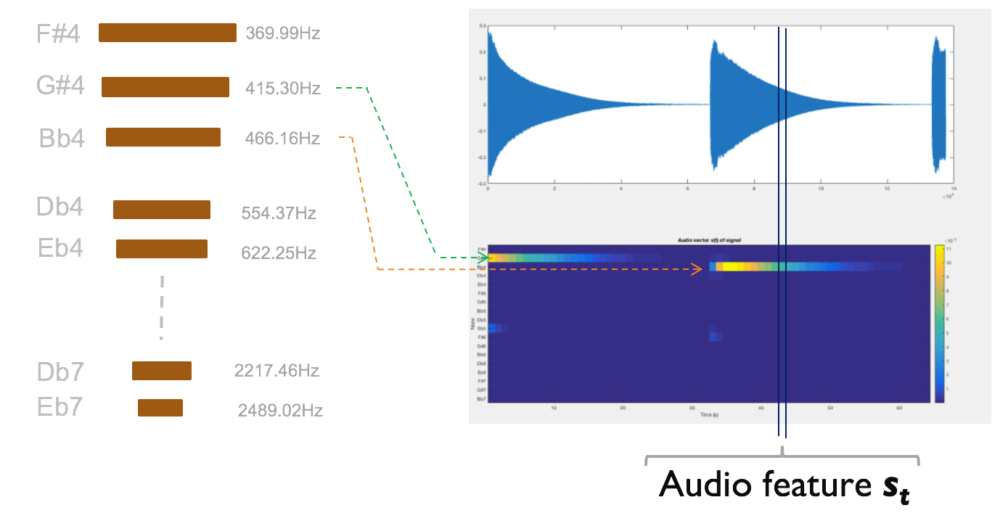
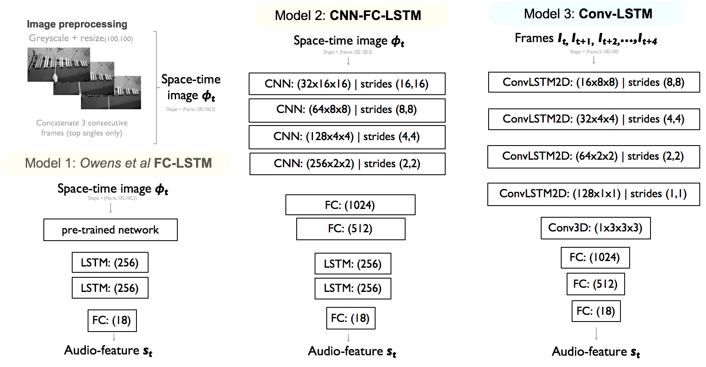
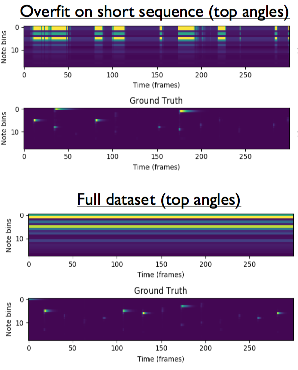
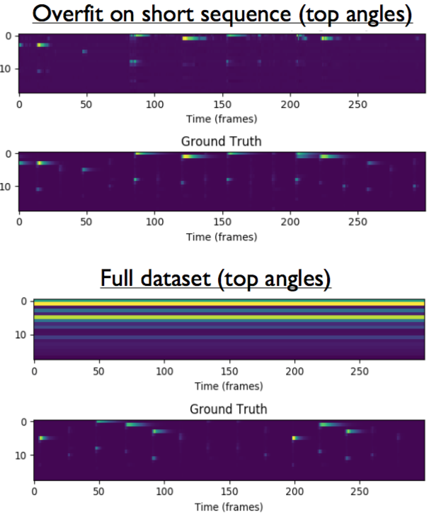

# Deep Auditory Hallucinations
Check out the demo video!

[](https://www.youtube.com/watch?v=23lJOX4Ioo4&feature=youtu.be)

# Overview
This projects explores cross-modal learning from the visual domain to the audio domain in the context of musical instruments. A neural network is trained on pairs of image sequences of a marimba being struck and the resulting sonic output.
Given a series of input images I<sub>1</sub>,I<sub>2</sub>,I<sub>3</sub>,...,I<sub>n</sub>, the neural network is tasked with producing the corresponding audio feature s<sub>1</sub>,s<sub>2</sub>,s<sub>3</sub>,...,s<sub>n</sub> where st ∈ R<sup>18</sup>. We initially approached this as a regression problem using an RNN that takes in CNN features as input.

The project was inspired by the work "Visually Indicated Sounds" by [Owens et al](http://vis.csail.mit.edu). However, unlike Owens et al, which worked with <i>unpitched</i> sounds from Nature and everyday objects composed of mainly <i>filtered white noise and impulses</i>, this work focuses on <b>pitched</b> musical instruments, specifically the marimba, that are <b>spectrally pure</b>.



<b>*At the time of writing, the CNN-LSTM is able to overfit a small sequence, but is not yet able to generalize to the entire dataset.*</b>

# GT Marimba Dataset
With a plethora of musical instruments to pick from, we choose the marimba for a number of compelling reasons:
* Pitch information is completely encoded in the spatial domain (notes on the left are lower, notes on the right are higher)
* Pitch information is encoded in the geometry of the bars (bigger bars = lower pitch, smaller bars = higher pitch)
* Timbre information is encoded in the texture and color of the bars (wood vs metal texture)
* The marimba is a spectrally pure instrument, dominated by a couple of sinusoids and very few overtones.



We use a stereo XY condensor microphone and an array of video cameras to capture a marimba being played. This provides approximately 6 hours of footage or roughly 850,000 frames. In every shot, we choose angles that maintain the full marimba keys to preserve relative spatial information.

We also provide an extended dataset of only top angle footage with small offsets. This was the easiest angle to train the neural network on. This amounts to approximately 3 hours of footage or 500,000 frames. 

# Image Feature


Like Owens et al, we use a "space-time" image consisting of 3 consecutive frames that have been grayscaled. Think of an image vector I<sub>n</sub> is like a single image where each RGB channel is a greyscale image. 

# Audio Feature
For a more complete description, see the paper linked below. Briefly, to account for differences in the video and audio sampling rates (25fps vs 48000Hz or fps), we calculate the equivalent "window" in the audio domain for every 3 frames of concatenated space time image in the visual domain. We apply a Hamming window, artificially zero-pad the segment and take a Short Time Fourier Transform (STFT).



Since the Marimba produces discrete, pitched notes, we can can map every frame of sound to a known note (essentially discretizing the frequency domain into 18 notes). At any time <i>t</i>, a single audio feature feature vector <b><i>s<sub>t</sub></i></b> is a R<sup>18</sup> vector. Each dimension of the vector contains the instantaneous amplitude of the frequency bin. A series of audio vectors thus captures how the amplitude of discrete frequency bins change over time. 



Inspired by Owens et al, where the authors use both kNN and inverse synthesis to search and produce sounds, our audio feature also enables <i>both</i> nearest neighbour search and inverse synthesis of pitched marimba sounds. Briefly, the audio vector amplitudes can be interpolated and pointwise multiplied with 18 oscillators and summed via Additive Synthesis to reproduce the sound of the marimba!

# Architectures


We adopt 3 models in this work:
* An FC-LSTM closely modeled after Owens et al.
* A CNN-LSTM with a CNN component similar to [DeepMind's Atari playing DQN](https://arxiv.org/abs/1312.5602), and the LSTM from Owens et al.
* A Convolutional-LSTM similar to [Shi et al.](https://arxiv.org/abs/1506.04214)

# Results
#### FC-LSTM <br>
<br>
When using FC-LSTM to overfit a small sequence:
* The network produces the correct transients, but outputs every note at the same time. 
* The network outputs the statistical distribution of notes in the training data (we tended to hit lower notes more often than higer ones since they resonated longer)
* This is due to the use of a pre-trained network like AlexNet or VGG19. The pooling layers cause the network to be spatially invariant and output very similar CNN codes despite the mallet being in different places (because VGG19 still thinks it is marimba). In the case of Owens et al, the large variety in background and texture would be picked up by the pre-trained network.

#### CNN-LSTM <br>
<br>
When usinga CNN-LSTM to overfit a small sequence:
* The network is able to reconstruct the audio feature output with very good accuracy.
* The design pattern used in the CNN is a scaled-up version of the CNN used in the Atari-playing DQN. It consists of CNN layers that increase in filter number, decrease in filter size and decrease in filter stride. The authors reasoned that such a design pattern enables the CNN to be sensitive to the location of small details (like small enemy targets, in the case of Atari).
* At the time of writing, the network is still unable to generalize to the full data set.

#### Convolutional-LSTM<br>
Still training...

# Dependancies
To install the requirements used in this project, run the following command.
```
pip install -r requirements.txt
```
The main dependancies are:
* Python 3.5
* Keras 2.0.2
* Tensorflow 1.0.1
* Scikit-image

# Usage
To use the MatLab script to produce audio feature vectors from a video use:
```
code/MATLAB/extractAudioFeaturesMultFiles.m
```

To perform hyperparameter search on your own dataset use:
```
cd training_pipeline
cd lr_w_search
python controller.py
```

All helper functions for image processing and DSP are defined in:
```
extract_image_features/video_utils
```
All model helper functions (loading large h5py matrices etc, graphing results, custom callbacks etc.) are defined in:
```
training_pipeline/lr_w_search/model_utils
```
# Credits
* Deep Learning: Lamtharn (Hanoi) Hantrakul 
* Audio DSP: Lamtharn (Hanoi) Hantrakul 
* Image Processing: Lamtharn (Hanoi) Hantrakul & Si Chen
* Advisor: Prof. James Hays
* Special thanks to Dr. Mason Bretan for insightful discussion and advice throughout the project. 
